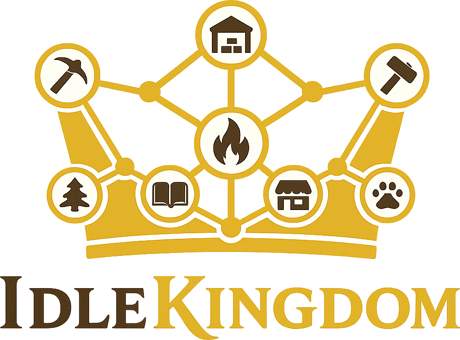

<p align="center">
  
</p>

# IdleKingdom

A web-based **idle / automation game** set in the besieged fortress-city of **Yensburg** — rebuild a war economy from a single mine, automate production chains, arm a hero, and reclaim six fallen walls. Inspired by _Kingdom Inc._

**▶ Play:** https://dev.jdayers.com/kingdom/

---

## The loop

Harvest raw resources → run them through crafting chains → sell goods at the Market for **Gold** → spend **Research** to unlock machines, recipes, and bonuses → upgrade & expand → forge gear and equip a hero → launch timed **expeditions** that reclaim territory (which in turn unlocks more factory content) → reclaim all six territories to win. **True idle:** production keeps accruing while you're away, with an offline catch-up on return.

## Tech & design

- **Vanilla JS, native ES modules, buildless** — no framework, no bundler, no runtime dependencies. Served as static files; `PascalCase` file & directory names.
- **Headless engine** (`Source/Engine/`) — a pure, DOM-free state machine, fully unit-tested. One-way data flow: the UI dispatches _intents_, the engine mutates state and emits a frozen _snapshot_, the UI renders the snapshot.
- **Rate-based steady-state simulation** — a topological solver computes per-node throughput (with fan-out conservation); offline progress is the same rates integrated over elapsed time, clamped to a cap.
- **DOM + SVG UI** (`Source/UI/`) — a small hand-rolled `h()`/`patch` reconciler over a bespoke SVG factory graph, built on [Web Awesome](https://webawesome.com) components + Font Awesome Pro **Duotone** icons (buildless, vendored).
- **Persistence** — `localStorage` behind a `StorageAdapter` seam; versioned save migrations; corruption falls back to a fresh game.

## Repository layout

```
Index.html              Single entry (mounts #App, loads Source/Main.js)
Manifest.webmanifest    PWA manifest        ServiceWorker.js   Offline shell cache
Source/
  Main.js               Composition root: bootstrap, RAF tick, autosave
  Engine/               Headless: GameState, Simulation (RateSolver/Tick/Offline),
                        Systems (Economy/Research/Expedition/Hero/Progression),
                        Content (data), Persistence, Intents, Reducer, Snapshot
  UI/                   DOM/SVG: App, Hud, GraphView, panels, Render helpers, Icons
  Styles/               Flat-fantasy CSS (parchment / iron / gold)
  Vendor/               Vendored Web Awesome + Font Awesome Pro (committed, buildless)
Tests/                  Zero-dependency node test runner + suites + probes
```

## Develop

```bash
# Run it locally (no build step):
python3 -m http.server 8137
# then open http://localhost:8137/Index.html

# Run the test suite (zero deps, just node):
node Tests/RunAll.js
```

- The headless engine is covered by the test suite; UI/Web-Awesome behavior is verified in a real browser (it doesn't render under the node test shim).
- **Vendoring** (`Source/Vendor/`): the Web Awesome + Font Awesome Pro assets are committed for buildless serving. Refreshing them requires a Font Awesome npm token (private registry) in a **gitignored** `.npmrc` — see the `FontAwesome Pro` entry in personal memory; see `Source/Vendor/.npmrc.example`.
- **Deploy:** a buildless `rsync` of the static files to the dev host (credentials in personal memory). Bump `ServiceWorker.js`'s `CACHE` version on each deploy so clients pick up changes.

## Gameplay

- **Node-graph factory.** Place machines on an open canvas and wire outputs to inputs (drag from a port, or tap-port-then-port on touch). Each link carries a specific resource, and a producer's links auto-follow its current output.
- **Rate-based economy.** A steady-state solver computes each machine's throughput with demand-limited fan-in — multiple feeders share a consumer's demand, so nothing is over-produced. Every node shows its state at a glance: **MAX** (at capacity), **LOW** (running but under capacity), or **OFF** (connected but idle).
- **Research tree.** Spend **Research** to unlock machines, recipes, Market listings, production & market bonuses, hero slots, gear tiers, and auto-sell.
- **Expeditions & heroes.** Forge permanent tiered gear (weapon / armor / accessory), equip and level a hero, then launch timed, deterministic expeditions (hero power must meet the requirement). Reclaiming a territory unlocks more factory content; reclaim all six to win, then keep going in free-play.
- **Buildings (groups).** Marquee-drag or **Ctrl/Cmd-click** to select machines, then use the floating action bar to **Group / Copy / Paste / Delete**. Groups can be moved, resized, renamed, and **nested** — a group of machines plus other groups functions as one unit. Copy a group with or without its upgrade levels.
- **Build menu.** A bottom-centered bar of machine types; clicking a type pops up its placement options directly above it.
- **Quality of life.** Undo/redo and keyboard shortcuts (Ctrl+Z / Ctrl+Y, C / V copy-paste, Delete, arrow-nudge, Esc), snap-to-grid, optional always-on rates, and sound effects — all toggleable in Settings.
- **True idle + offline.** Production keeps accruing while the tab is closed; on return a "While you were away" summary credits up to **1 hour** of offline progress.
- **Installable PWA.** Runs offline via a service worker; `localStorage` save with versioned migrations (a corrupt save falls back to a fresh game).

## Machine types

| Machine          | Role                                                                                                                              |
| ---------------- | --------------------------------------------------------------------------------------------------------------------------------- |
| **Gatherer**     | Harvests a raw resource (Iron Ore, Timber, Raw Hide, Coal Seam, Gemstone) — takes no inputs.                                      |
| **Smelter**      | Smelts a recipe: Iron Bar, Plank, Leather, Refined Coal, or Steel.                                                                |
| **Workshop**     | Crafts components & gear: Fitting, Blade, Plating, Sword, Plate Armor, Shield, Parchment.                                         |
| **Market**       | Sells incoming **listed** goods for Gold (plus a small Research tithe); listings are unlocked by research.                        |
| **Scholar**      | Consumes Parchment to generate Research.                                                                                          |
| **Storage Room** | A capacity-capped pass-through buffer — holds up to _level_ resource types in a shared pool and stockpiles surplus up to the cap. |

Three currencies drive it all: **Gold** (build, upgrade, copy), **Research** (unlocks & bonuses), and **Renown** (expeditions & heroes).
